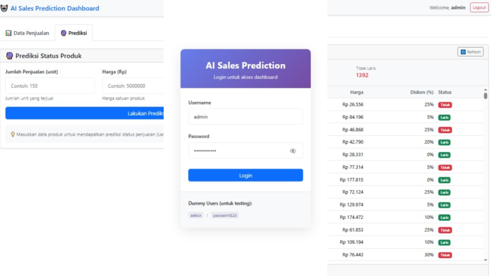
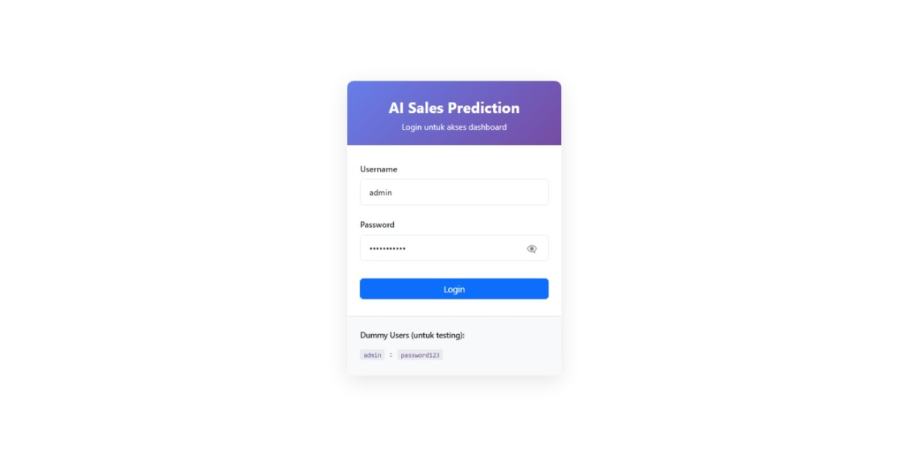
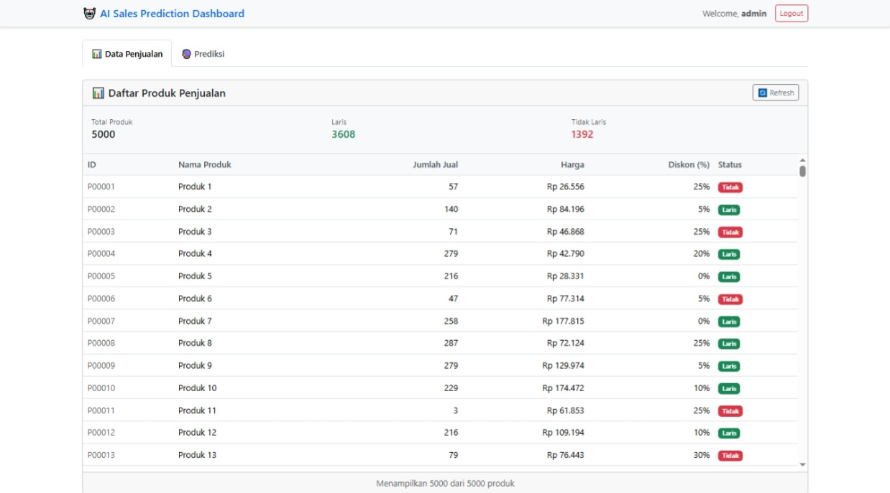
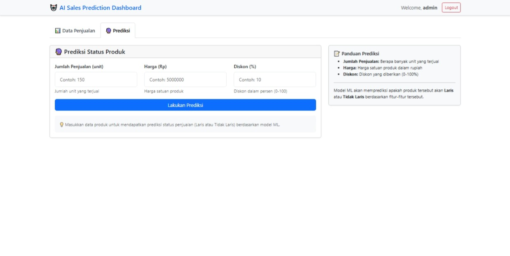
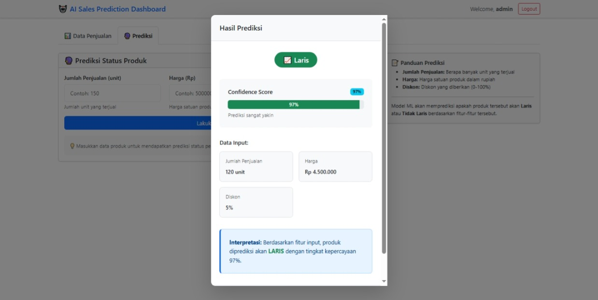

# Mini AI Sales Prediction System



A complete machine learning system for predicting product sales status using FastAPI backend, React frontend, and scikit-learn classification model.

## Overview

This project demonstrates a full-stack ML application with:
- REST API backend (FastAPI + Python)
- React frontend with JWT authentication
- Machine learning pipeline with scikit-learn
- Professional code quality and documentation

**Status:** Production-ready for study case deployment.

## Quick Start

### Prerequisites
- Python 3.11+
- Node.js 16+
- Git

### Installation

1. Clone or download the project
```bash
cd project-root
```

2. Start Backend (Terminal 1)
```bash
cd backend
python -m venv venv

# Windows
venv\Scripts\activate
# Linux/Mac
source venv/bin/activate

pip install -r requirements.txt
python main.py
```

Backend runs at `http://localhost:8000`

3. Start Frontend (Terminal 2)
```bash
cd frontend
npm install
npm run dev
```

Frontend runs at `http://localhost:3000`

4. Access application
- Open browser: `http://localhost:3000`
- Login with: Username `admin`, Password `password123`

## Project Structure

```
project-root/
├── backend/              # FastAPI backend
│   ├── main.py               # FastAPI application
│   ├── models.py             # Pydantic request/response schemas
│   ├── routes/               # API endpoints
│   │   ├── auth.py           # Authentication endpoints
│   │   ├── sales.py          # Sales data endpoints
│   │   └── predict.py        # ML prediction endpoint
│   ├── utils/                # Utility modules
│   │   ├── auth.py           # JWT token utilities
│   │   ├── data.py           # CSV data utilities
│   │   └── ml.py             # ML model utilities
│   ├── requirements.txt          # Python dependencies
│   ├── README.md                 # Backend documentation
│   ├── SETUP.md                  # Backend quick start
│   └── .gitignore
│
├── frontend/             # React frontend
│   ├── src/
│   │   ├── pages/
│   │   │   ├── LoginPage.jsx     # Login page
│   │   │   └── Dashboard.jsx     # Main dashboard
│   │   ├── components/
│   │   │   ├── SalesTable.jsx    # Sales data table
│   │   │   ├── PredictionForm.jsx # Prediction form
│   │   │   └── PredictionResult.jsx # Result display
│   │   ├── utils/
│   │   │   └── api.js            # Axios API service
│   │   ├── styles/
│   │   │   ├── App.css           # Global styles
│   │   │   ├── LoginPage.css     # Login styles
│   │   │   └── PredictionResult.css # Modal styles
│   │   ├── App.jsx               # Main component
│   │   └── main.jsx              # Entry point
│   ├── index.html                # HTML template
│   ├── vite.config.js            # Build configuration
│   ├── package.json              # Node dependencies
│   ├── README.md                 # Frontend documentation
│   ├── SETUP.md                  # Frontend quick start
│   └── .gitignore
│
├── data/                 # Training data
│   └── sales_data.csv    # Sales dataset
│
├── ml/                       # Machine learning files
│   ├── Training_model.ipynb  # Notebook untuk pelatihan model
│   └── model/                # Serialized model artifacts
│       ├── model.joblib      # Trained classification model
│       └── scaler.joblib     # Feature scaler
│
└── README.md                     # This file
```

## System Architecture

### Technology Stack

**Backend**
- Framework: FastAPI 0.104.1
- Server: Uvicorn
- Authentication: JWT (python-jose)
- ML: scikit-learn, pandas, numpy
- Serialization: joblib
- Language: Python 3.8+

**Frontend**
- Framework: React 18.2
- Build Tool: Vite 5.0
- HTTP Client: Axios
- Styling: Bootstrap 5.3, custom CSS
- Language: JavaScript ES6+

**Machine Learning**
- Algorithm: Random Forest Classifier
- Features: 3 (jumlah_penjualan, harga, diskon)
- Classes: 2 (Laris, Tidak Laris)
- Preprocessing: StandardScaler
- Training/Test Split: 80/20
- Model Accuracy: 90%

### Architecture Diagram

```
Frontend (React)                Backend (FastAPI)              ML Model
    |                              |                            |
    +---> HTTP/REST API ---------> |                            |
    |     (Axios)                  |                            |
    |                              |                            |
    |  1. POST /login              |                            |
    |     Returns JWT token        |                            |
    |                              |                            |
    |  2. GET /sales               |                            |
    |     Returns sales data       |                            |
    |                              |                            |
    |  3. POST /predict            |                            |
    |     Input: features    -----> Load Model ---------> model.joblib
    |     Output: prediction       Apply scaler        scaler.joblib
    |                              Return confidence   
    |                              |
    +<---------- JSON Response ----+
```

## Key Features

### Backend Features
- JWT authentication with dummy users
- REST API with Swagger documentation
- Sales data management (CSV-based)
- ML model serving and prediction
- Comprehensive error handling
- Request/response validation with Pydantic
- Logging and monitoring

### Frontend Features
- Login authentication with token management
- Sales data dashboard with summary statistics
- Interactive prediction form
- Real-time prediction results with confidence scores
- Responsive Bootstrap design
- Token-based API communication
- Error handling and loading states

### ML Pipeline Features
- Data preprocessing and validation
- Feature normalization with StandardScaler
- Train-test split with stratification
- Random Forest classification model
- Model evaluation metrics (accuracy, precision, recall, F1)
- Feature importance analysis
- Model serialization with joblib

## API Overview

### Authentication
```
POST /api/auth/login
```
Authenticate user and get JWT token.

### Sales Data
```
GET /api/sales/
GET /api/sales/summary
```
Retrieve sales data and statistics.

### Prediction
```
POST /api/predict/
GET /api/predict/health
```
Make predictions and check model health.

For detailed API documentation, see [API_DOCUMENTATION.md](API_DOCUMENTATION.md)

## Setup Instructions

### Backend Setup
```bash
cd backend_project

# Create virtual environment
python -m venv venv

# Activate
# Windows:
venv\Scripts\activate
# Linux/Mac:
source venv/bin/activate

# Install dependencies
pip install -r requirements.txt

# Start server
python -m backend.main
```

Backend documentation: [backend_project/README.md](backend_project/README.md)

### Frontend Setup
```bash
cd frontend_project

# Install dependencies
npm install

# Start development server
npm run dev

# Build for production
npm run build
```

Frontend documentation: [frontend_project/README.md](frontend_project/README.md)

## Usage

### Login
1. Open http://localhost:3000
2. Enter credentials:
   - Username: admin, Password: password123
   - Username: user, Password: user123
   - Username: hefri, Password: hefri123

### View Sales Data
1. Click "Data Penjualan" tab
2. View sales table with product information
3. See summary statistics
4. Click "Refresh" to update data

### Make Prediction
1. Click "Prediksi" tab
2. Enter product parameters:
   - Jumlah Penjualan: number of units sold
   - Harga: product price in Rupiah
   - Diskon: discount percentage (0-100)
3. Click "Lakukan Prediksi"
4. View result modal with:
   - Prediction (Laris or Tidak Laris)
   - Confidence score
   - Input data recap

## Screenshots

### Login Page

*Login page with authentication form*

### Dashboard - Sales Data

*Sales data table with summary statistics*

### Prediction Form

*Interactive prediction form for product sales status*

### Prediction Result

*Prediction result modal showing outcome and confidence*

## Documentation

- [ARCHITECTURE.md](ARCHITECTURE.md) - System design and components
- [API_DOCUMENTATION.md](API_DOCUMENTATION.md) - Complete API reference
- [backend_project/README.md](backend_project/README.md) - Backend detailed docs
- [backend_project/SETUP.md](backend_project/SETUP.md) - Backend quick start
- [frontend_project/README.md](frontend_project/README.md) - Frontend detailed docs
- [frontend_project/SETUP.md](frontend_project/SETUP.md) - Frontend quick start

## Development

### Code Quality
- Type hints with Pydantic (backend)
- ES6+ with React Hooks (frontend)
- Comprehensive error handling
- Logging and monitoring
- Clean code structure

### Testing Backend
```bash
# Login
curl -X POST http://localhost:8000/api/auth/login \
  -H "Content-Type: application/json" \
  -d '{"username":"admin","password":"password123"}'

# Get sales data
curl -X GET http://localhost:8000/api/sales/ \
  -H "Authorization: Bearer <TOKEN>"

# Make prediction
curl -X POST http://localhost:8000/api/predict/ \
  -H "Authorization: Bearer <TOKEN>" \
  -H "Content-Type: application/json" \
  -d '{"jumlah_penjualan":120,"harga":4500000,"diskon":8}'
```

### Testing Frontend
Use Swagger UI at http://localhost:8000/docs for interactive API testing.

## Machine Learning

### Model Information
- Type: Random Forest Classifier
- Features: 3
- Classes: 2
- Training Samples: 40
- Test Samples: 10
- Test Accuracy: 90%
- Test F1-Score: 90.91%

### Feature Importance
1. jumlah_penjualan: 52.83%
2. harga: 24.41%
3. diskon: 22.76%

### Retraining Model
To train with new data:
```bash
cd backend_project

# Update data/sales_data.csv with new data

# Run training pipeline
python ml_train.py
```

New model will be saved to backend/ml/model.joblib and scaler.joblib

## Deployment

For deployment instructions, see [DEPLOYMENT.md](DEPLOYMENT.md)

Quick deployment options:
- Heroku (backend + frontend)
- Vercel (frontend only)
- AWS EC2 (full stack)
- DigitalOcean App Platform

## Troubleshooting

### Backend Won't Start
```bash
# Check Python version
python --version

# Clear cache
pip cache purge

# Reinstall dependencies
pip install -r requirements.txt --force-reinstall
```

### Frontend Won't Start
```bash
# Check Node version
node --version

# Clear npm cache
npm cache clean --force

# Reinstall dependencies
rm -rf node_modules package-lock.json
npm install
```

### Port Already in Use
```bash
# Linux/Mac
lsof -i :8000  # Backend
lsof -i :3000  # Frontend
kill -9 <PID>

# Windows
netstat -ano | findstr :8000
taskkill /PID <PID> /F
```

### CORS Error
Ensure backend CORS is configured properly in backend/main.py

### Model Not Loading
Ensure model.joblib and scaler.joblib exist in backend/ml/ folder.
Run `python ml_train.py` to generate them.

## Performance Notes

- Backend response time: < 100ms
- Model prediction time: < 50ms
- Frontend bundle size: < 500KB
- Initial load time: < 3s

## Security

Production considerations:
- Change SECRET_KEY in backend
- Use HTTPS
- Implement proper authentication (not dummy users)
- Add rate limiting
- Sanitize inputs
- Use environment variables
- Add CORS restrictions

## License

This project is created for educational purposes.

## Author

Created for AI Sales Prediction Study Case - April 2026

## Support

For issues or questions:
1. Check relevant README.md file
2. Review ARCHITECTURE.md for system design
3. Check API_DOCUMENTATION.md for API details
4. Review code comments for implementation details

## Status

Development: Complete
Testing: Complete
Documentation: Complete
Production Ready: Yes

---

**Last Updated:** April 2026
**Version:** 1.0.0
